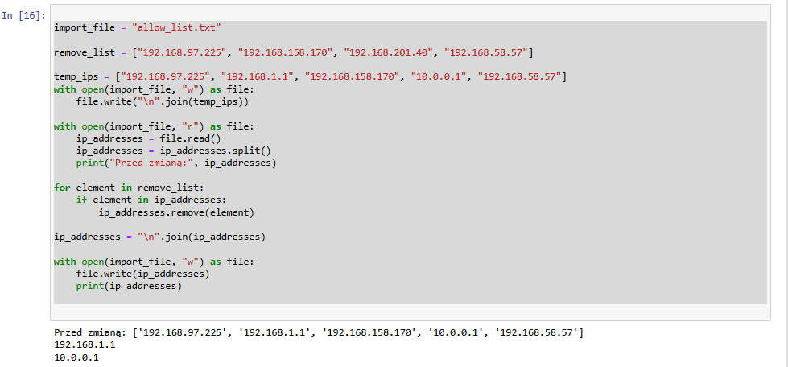

# Python_algorytm_update

## Krótki projekt, który przedstawia możliwości języka Python w zakresie automatyzacji aktualizowania danych. Korzystając z `with open`, zmiennych, listy `[]`, pętli `for`, warunku `if` stworzyłem prosty algorytm aktualizujący listę adresów IP, który usuwa niechciane adresy.

### Importuje plik z listą adresów  IP, którą będę aktualizował wraz z listą adresów IP do usunięcia.
```python
import_file = "allow_list.txt"

remove_list = ["192.168.97.225", "192.168.158.170", "192.168.201.40", "192.168.58.57"]
```
### Odświeżam plik tak aby dla demonstracji wracał do stanu początkowego przed uruchomieniem kodu.

```python
temp_ips = ["192.168.97.225", "192.168.1.1", "192.168.158.170", "10.0.0.1", "192.168.58.57"]
with open(import_file, "w") as file:
    file.write("\n".join(temp_ips))
```
### Otwieram plik z teskstem zawierającym adresy IP. Dzielę go za pomocą komendy `.split()` aby uzyskać listę, z którą mogę pracować.

```python 
with open(import_file, "r") as file:
    ip_addresses = file.read()
    ip_addresses = ip_addresses.split()
    print("Przed zmianą:", ip_addresses)
```
### Tworzę pętlę `for`, która wykrywa adresy IP na liście do usunięcia, a następnie usuwa je z głównej listy za pomocą komendy `.remove()`.

```python
for element in remove_list:
    if element in ip_addresses:
        ip_addresses.remove(element)
```
### Łączę nowo powstałą listę w jeden ciąg za pomocą `.join()` aby wygodnie z niej korzystać.

```python    
ip_addresses = "\n".join(ip_addresses)
```
### Zapisuję tak powstały plik za pomocą `.write()`, a następnie wyświetlam go za pomocą `print`.

```python 
with open(import_file, "w") as file:
    file.write(ip_addresses)
    print(ip_addresses)

```

## Zrzut ekranu z laboratoriów **<span style="color:#40e0d0;">GOOGLE</span>** wraz z kodem w całości:

